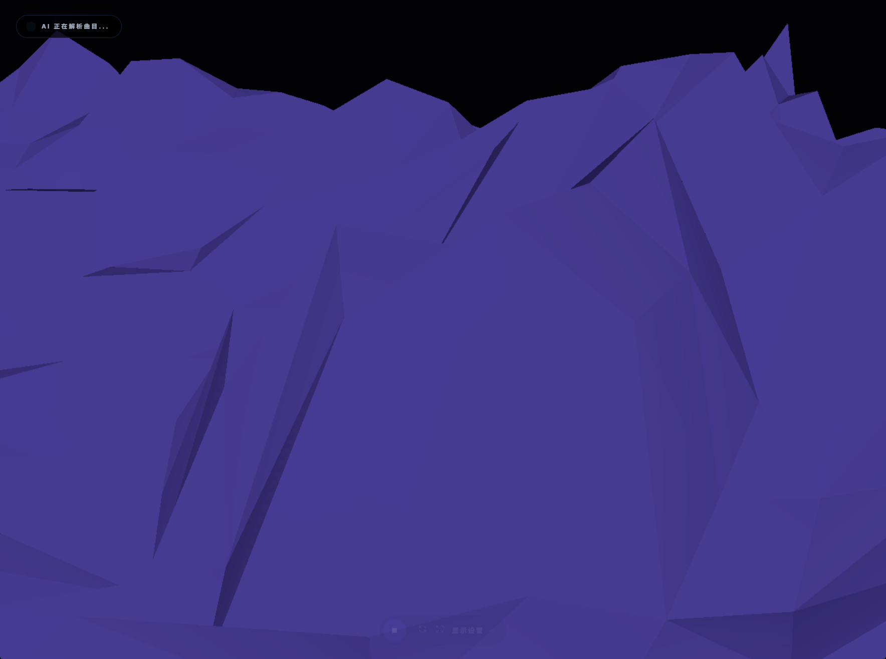

# Aura Vision 🎵👁️

### AI-Powered 3D Music Visualizer & Identifier (v0.4.1)

[中文文档](README_ZH.md) | [Live Demo](https://aura-vision.vercel.app/)

  

  
  
  
  
  

**Aura Vision** is a cutting-edge web application that transforms live audio into immersive 3D generative art. By combining advanced spectral analysis with **Google Gemini 3.0**, it not only visualizes the rhythm but also identifies the music and adapts its visual mood in real-time.

---

## 📸 Visual Showcase

| Silk Waves (WebGL) | Liquid Sphere (3D) | Plasma Flow (2D) |
| :---: | :---: | :---: |
|  |  |  |

---

## 🚀 Innovative Use Cases

Aura Vision is designed for professional and casual environments:

*   **📺 Live Streaming (OBS/Streamers):** High-fidelity, reactive background for Twitch or YouTube.
*   **🎭 Professional VJing:** Plug-and-play visual support for DJ sets or parties.
*   **🌿 Ambient Mood Decor:** Cast to a Smart TV for a sophisticated digital atmosphere.
*   **🧘 Relaxation:** Calm, therapeutic visual environments for meditation.
*   **💻 Focus Companion:** A beautiful, non-distracting visual flow for deep work.

## ✨ Key Features

*   **🧠 Gemini 3.0 Integration:** Real-time song recognition and semantic mood analysis.
*   **🎨 12+ Generative Engines:** From classic frequency bars to advanced WebGL physics scenes.
*   **🔠 Reactive Typography:** Dynamic custom text that pulses and rotates with the bass.
*   **🌍 Multi-language Support:** Localized for Global, CN, JP, KR, EU, and LATAM markets.

## 🛠️ Tech Stack

*   **Graphics:** Three.js & React Three Fiber
*   **AI:** Google Generative AI (Gemini 3 Flash)
*   **Frontend:** React 18.3.1, Tailwind CSS
*   **Audio:** Web Audio API (Real-time FFT)

---
*Made with 💜 using React and Google Gemini API*