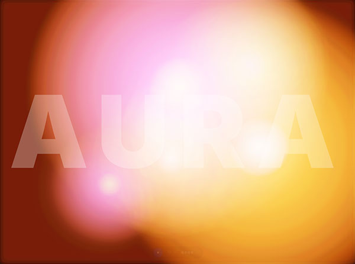

# Aura Vision 🎵👁️

### AI-Powered 3D Music Visualizer & Identifier (v0.7.5)

[中文文档](README_ZH.md) | [Live Demo](https://aura.tanox.net/) | [Changelog](CHANGELOG.md)

<!-- README.md -->

  
  
  
  
  

**Aura Vision** is a cutting-edge web application that transforms live audio into immersive 3D generative art. By combining advanced spectral analysis with **Google Gemini 3.0**, it not only visualizes the rhythm but also identifies the music and adapts its visual mood in real-time.

---

## 📸 Visual Showcase

| Aura Wave | Liquid Sphere (3D) | Plasma Flow |
| :---: | :---: | :---: |
|  |  |  |

---

## 🎮 How to Use

**🚀 Instant Access:** Simply open the **[Live Demo](https://aura.tanox.net/)** on any modern device. No installation required.

1.  **Grant Permissions:** Click "Start" and allow the browser to access your audio input.
2.  **Play Music:** Play audio near your device. The visuals react to the microphone in real-time.
3.  **Explore Modes:** Open the **Options** panel (or press `H`) to switch visual engines.
4.  **AI Recognition:** Press `L` to identify the current song and its mood.

### ⌨️ Keyboard Shortcuts

| Key | Action |
| :--- | :--- |
| **Space** | Toggle Microphone Input |
| **F** | Toggle Fullscreen Mode |
| **R** | Randomize Visuals & Colors |
| **L** | Toggle AI Lyrics/Info |
| **H** | Toggle Control Panel |
| **G / T** | Toggle Glow / Trails |

---
*Made with 💜 using React and Google Gemini API*