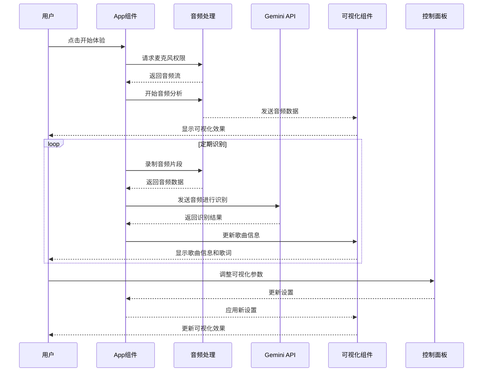
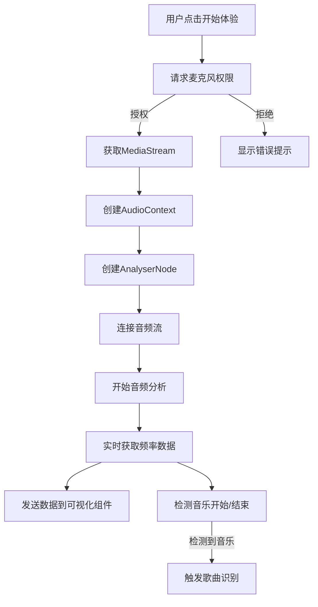
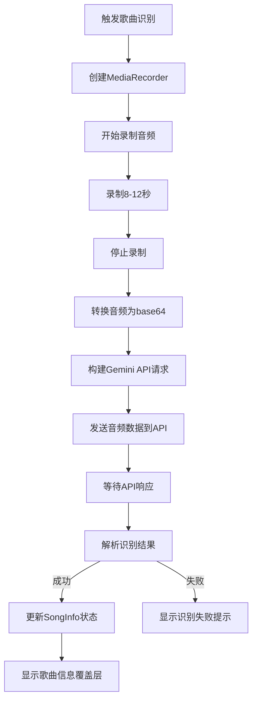
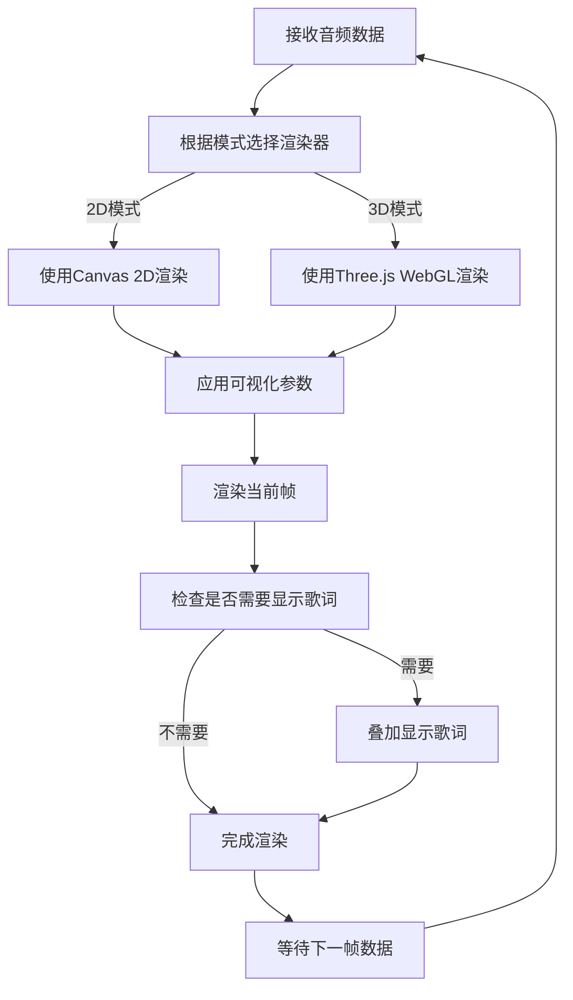
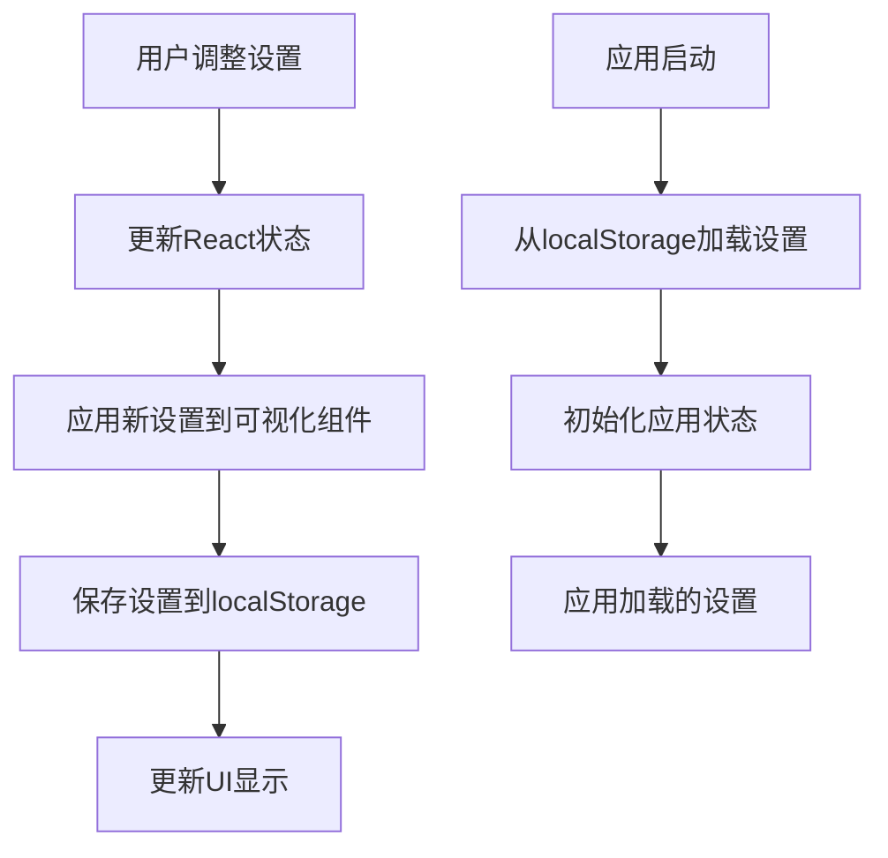

# SonicVision 架构文档

## 目录

- [系统架构概述](#系统架构概述)
  - [核心流程](#核心流程)
- [目录结构](#目录结构)
- [核心组件](#核心组件)
  - [App 组件](#app-组件)
  - [VisualizerCanvas 组件](#visualizercanvas-组件)
  - [ThreeVisualizer 组件](#threevisualizer-组件)
  - [Controls 组件](#controls-组件)
  - [SongOverlay 组件](#songoverlay-组件)
- [服务层](#服务层)
  - [geminiService](#geminiservice)
  - [visualizerStrategies](#visualizerstrategies)
- [数据模型](#数据模型)
  - [主要类型定义](#主要类型定义)
- [技术依赖](#技术依赖)
- [关键功能实现](#关键功能实现)
  - [音频捕获和分析](#音频捕获和分析)
  - [歌曲识别](#歌曲识别)
  - [可视化渲染](#可视化渲染)
  - [多语言支持](#多语言支持)
  - [本地存储](#本地存储)
- [组件交互流程图](#组件交互流程图)
- [性能优化](#性能优化)
- [扩展性考虑](#扩展性考虑)
- [浏览器兼容性](#浏览器兼容性)

## 系统架构概述

SonicVision 采用前端单页应用架构，主要基于 React 和 TypeScript 构建。系统通过浏览器的 Web Audio API 捕获音频输入，使用 Google Gemini API 进行歌曲识别，并通过 Canvas 2D 或 Three.js WebGL 生成可视化效果。

### 核心流程

1. **音频捕获**：通过 Web Audio API 获取麦克风输入
2. **音频分析**：使用 AnalyserNode 实时分析音频频率数据
3. **歌曲识别**：定期录制音频片段并发送到 Google Gemini API 进行识别
4. **可视化渲染**：根据音频数据和识别结果生成动态视觉效果
5. **用户交互**：提供控制面板允许用户调整可视化参数

## 目录结构

```
SonicVision/
├── components/         # React 组件
│   ├── VisualizerCanvas.tsx   # 2D 可视化组件
│   ├── ThreeVisualizer.tsx    # 3D WebGL 可视化组件
│   ├── Controls.tsx           # 用户控制面板
│   ├── SongOverlay.tsx        # 歌曲信息覆盖层
│   └── HelpModal.tsx          # 帮助模态框
├── services/          # 服务层
│   ├── geminiService.ts       # Google Gemini API 服务
│   ├── fingerprintService.ts  # 音频指纹服务
│   └── visualizerStrategies.ts # 可视化策略
├── App.tsx            # 主应用组件
├── constants.ts       # 常量定义
├── types.ts           # TypeScript 类型定义
├── translations.ts    # 多语言支持
└── package.json       # 项目依赖
```

## 核心组件

### App 组件

**文件**：`App.tsx`

**功能**：
- 管理应用的整体状态
- 处理音频捕获和分析
- 协调歌曲识别流程
- 根据可视化模式选择合适的渲染器
- 提供用户界面布局

**主要状态**：
- `isListening`：是否正在捕获音频
- `analyser`：音频分析节点
- `mode`：当前可视化模式
- `colorTheme`：当前颜色主题
- `settings`：可视化设置
- `currentSong`：当前识别的歌曲信息
- `language`：界面语言

**代码示例**：

```typescript
// 音频捕获和分析初始化
const startAudio = async (deviceId?: string) => {
  try {
    const constraints: MediaStreamConstraints = {
      audio: {
        deviceId: deviceId ? { exact: deviceId } : undefined,
        echoCancellation: false,
        autoGainControl: false,
        noiseSuppression: false,
        channelCount: 2
      }
    };

    const stream = await navigator.mediaDevices.getUserMedia(constraints);
    const ctx = new (window.AudioContext || (window as any).webkitAudioContext)();
    if (ctx.state === 'suspended') await ctx.resume();

    const src = ctx.createMediaStreamSource(stream);
    const ana = ctx.createAnalyser();
    ana.fftSize = 2048;
    ana.smoothingTimeConstant = 0.85;
    src.connect(ana);
    
    setAudioContext(ctx);
    setAnalyser(ana);
    setMediaStream(stream);
    setIsListening(true);
    
    setupRecorder(stream);
    requestWakeLock();
  } catch (err) {
    console.error("Error accessing microphone:", err);
    alert("Could not access audio device. Please check permissions.");
  }
};
```

### VisualizerCanvas 组件

**文件**：`components/VisualizerCanvas.tsx`

**功能**：
- 使用 Canvas 2D API 渲染可视化效果
- 支持多种 2D 可视化模式
- 显示歌词（如果可用）

**支持的模式**：
- BARS：频谱柱状图
- PLASMA：等离子体效果
- PARTICLES：粒子效果
- TUNNEL：隧道效果
- SHAPES：几何形状效果
- RINGS：环形效果
- NEBULA：星云效果
- KALEIDOSCOPE：万花筒效果

### ThreeVisualizer 组件

**文件**：`components/ThreeVisualizer.tsx`

**功能**：
- 使用 Three.js WebGL 渲染 3D 可视化效果
- 提供更复杂的视觉体验

**支持的模式**：
- SILK：丝绸效果
- LIQUID：液体效果
- TERRAIN：地形效果

### Controls 组件

**文件**：`components/Controls.tsx`

**功能**：
- 提供用户界面控件
- 允许用户调整可视化参数
- 支持切换可视化模式
- 控制麦克风开关

### SongOverlay 组件

**文件**：`components/SongOverlay.tsx`

**功能**：
- 显示识别的歌曲信息
- 提供歌词预览
- 允许用户重试识别或关闭信息

## 服务层

### geminiService

**文件**：`services/geminiService.ts`

**功能**：
- 与 Google Gemini API 交互
- 发送音频数据进行歌曲识别
- 处理 API 响应并解析歌曲信息

**代码示例**：

```typescript
// 识别歌曲的核心函数
export const identifySongFromAudio = async (
  audioBase64: string,
  mimeType: string,
  language: Language,
  region: Region
): Promise<SongInfo | null> => {
  try {
    // 初始化 Gemini 客户端
    const genAI = new GoogleGenerativeAI(API_KEY);
    const model = genAI.getGenerativeModel({ model: "gemini-1.5-pro" });
    
    // 构建提示词
    const prompt = `Identify this song from the audio. Return only the following information:\n` +
      `Title: [song title]\n` +
      `Artist: [artist name]\n` +
      `Lyrics: [short lyrics snippet]\n` +
      `Mood: [song mood]`;
    
    // 发送音频数据进行识别
    const result = await model.generateContent([
      prompt,
      { 
        inlineData: {
          data: audioBase64,
          mimeType 
        }
      }
    ]);
    
    // 解析响应
    const response = result.response;
    const text = response.text();
    
    // 提取歌曲信息
    const songInfo = parseSongInfo(text);
    return songInfo;
  } catch (error) {
    console.error("Error identifying song:", error);
    return null;
  }
};
```

### visualizerStrategies

**文件**：`services/visualizerStrategies.ts`

**功能**：
- 实现不同的可视化策略
- 为每种可视化模式提供渲染逻辑

## 数据模型

### 主要类型定义

**文件**：`types.ts`

**核心类型**：

- `VisualizerMode`：枚举类型，定义所有支持的可视化模式
- `LyricsStyle`：枚举类型，定义歌词显示样式
- `SongInfo`：接口，包含歌曲信息
- `VisualizerSettings`：接口，包含可视化设置参数
- `AudioDevice`：接口，包含音频设备信息

**代码示例**：

```typescript
// 可视化模式枚举
export enum VisualizerMode {
  BARS = 'BARS',
  PLASMA = 'PLASMA',
  PARTICLES = 'PARTICLES',
  TUNNEL = 'TUNNEL',
  SHAPES = 'SHAPES',
  RINGS = 'RINGS',
  NEBULA = 'NEBULA',
  KALEIDOSCOPE = 'KALEIDOSCOPE',
  // WebGL Modes
  SILK = 'SILK',
  LIQUID = 'LIQUID',
  TERRAIN = 'TERRAIN'
}

// 歌曲信息接口
export interface SongInfo {
  title: string;
  artist: string;
  lyricsSnippet?: string;
  mood?: string;
  identified: boolean;
  searchUrl?: string;
  matchSource?: 'AI' | 'LOCAL';
}
```

## 技术依赖

| 依赖 | 版本 | 用途 |
|------|------|------|
| React | 18.3.1 | 构建用户界面 |
| TypeScript | ~5.8.2 | 类型检查和开发 |
| Three.js | 0.164.1 | 3D WebGL 可视化 |
| @react-three/fiber | 8.16.8 | React 集成 Three.js |
| @react-three/postprocessing | 2.16.2 | Three.js 后期处理 |
| @google/genai | ^1.35.0 | Google Gemini API 客户端 |
| Vite | ^6.2.0 | 构建工具和开发服务器 |

## 关键功能实现

### 音频捕获和分析

使用浏览器的 Web Audio API 捕获麦克风输入，并通过 AnalyserNode 分析音频频率数据。音频数据被用于驱动可视化效果和检测音乐开始/结束。

### 歌曲识别

定期录制音频片段（通常为 8-12 秒），将其转换为 base64 格式，并发送到 Google Gemini API 进行识别。识别结果包括歌曲标题、艺术家和歌词片段。

### 可视化渲染

根据选择的模式，使用 Canvas 2D 或 Three.js WebGL 渲染可视化效果。可视化参数（如灵敏度、速度、颜色主题）可由用户调整。

### 多语言支持

通过 translations.ts 文件提供多语言支持，允许用户切换界面语言。

### 本地存储

使用 localStorage 存储用户偏好设置，包括可视化模式、颜色主题、歌词样式等。

## 组件交互流程图

### 1. 整体组件交互流程



### 2. 音频捕获和分析流程



### 3. 歌曲识别流程



### 4. 可视化渲染流程



### 5. 设置管理流程



## 性能优化

1. **音频处理优化**：使用适当的 fftSize 和 smoothingTimeConstant 平衡性能和视觉效果
2. **渲染优化**：对于 WebGL 模式，使用 requestAnimationFrame 确保平滑渲染
3. **API 调用优化**：实现智能的歌曲识别调度，避免频繁调用 API
4. **资源管理**：正确释放音频资源和 WebGL 资源，避免内存泄漏

## 扩展性考虑

1. **可视化模式扩展**：通过添加新的策略类，可以轻松添加新的可视化模式
2. **音频源扩展**：支持从文件或流媒体获取音频，而不仅限于麦克风输入
3. **歌曲识别服务扩展**：支持集成其他歌曲识别服务，如 Shazam 或 ACRCloud
4. **主题系统**：实现可定制的主题系统，允许用户创建和共享可视化主题

## 浏览器兼容性

SonicVision 依赖于现代浏览器特性，包括：

- Web Audio API
- MediaRecorder API
- Canvas API
- WebGL 2.0（对于 3D 可视化）
- ES6+ 特性

推荐使用 Chrome、Firefox、Safari 或 Edge 的最新版本。
